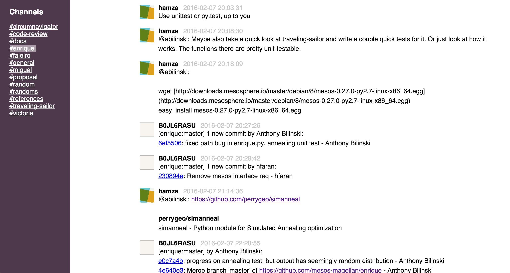

# Slack Export Viewer

A Slack Export archive viewer that allows you to easily view and share your
Slack team's export (instead of having to dive into hundreds of JSON files).




## Overview

`slack-export-viewer` is useful for small teams on a free Slack plan (limited to 10,000 messages) who overrun their budget and ocassionally need a nice interface to refer back to previous messages. You get a web interface to easily scroll through all channels in the export without having to look at individual JSON files per channel per day.

`slack-export-viewer` can be used locally on one machine for yourself to explore an export or it can be run on a headless server (as it is a Flask web app) if you also want to serve the content to the rest of your team.


## Usage

_NOTE: This fork has been modified by me to take the JSON files generated by my fork of [slack-auto-export](https://github.com/mcoster/slack-auto-export), instead of the manual Slack team export_

### 1) Run [slack-auto-export](https://github.com/mcoster/slack-auto-export)

### 2) Point `slack-export-viewer` to the generated output directory

Point slack-export-viewer to the output directory and let it do its magic

```bash
slack-export-viewer -z /path/to/export/dir
```

If everything went well, your archive will have been processed, and browser window will have opened showing your *#general* channel from the export.


## Installation

You will need to download this fork from git and install the requirements, eg.

```bash
git clone git@github.com:mcoster/slack-export-viewer.git
cd slack-export-viewer
pip install -r requirements.txt

$ slack-export-viewer --help
Usage: slack-export-viewer [OPTIONS]

Options:
  -p, --port INTEGER  Host port to serve your content on
  -z, --archive PATH  Path to your Slack export archive (.zip file or directory)
                      [required]
  -I, --ip TEXT       Host IP to serve your content on
  --no-browser        If you do not want a browser to open automatically, set
                      this.
  --debug
  --help              Show this message and exit.
```


## Acknowledgements

Credit to Pieter Levels whose [blog post](https://levels.io/slack-export-to-html/) and PHP script I used as a jumping off point for this.

### Improvements over Pieter's script

 `slack-export-viewer` is similar in core functionality but adds several things on top to make it nicer to use:

* An installable application
* Automated archive extraction and retention
* A Slack-like sidebar that lets you switch channels easily
* Much more "sophisticated" rendering of messages
* A Flask server which lets you serve the archive contents as opposed to a PHP script which does static file generation
